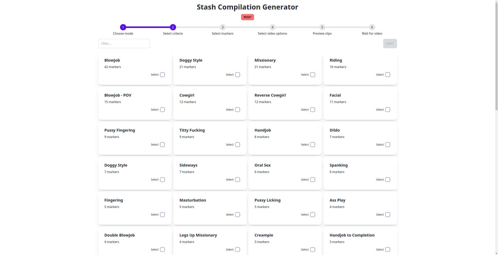
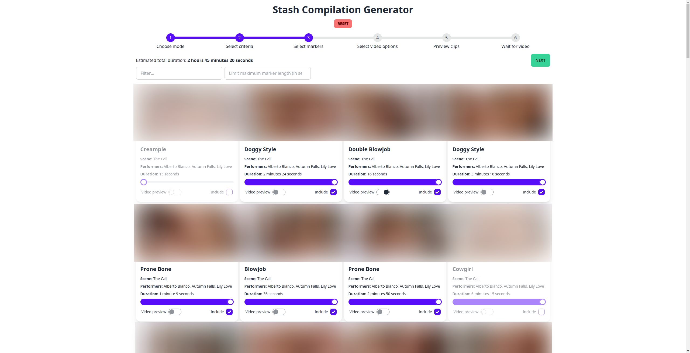

# stash-compilation-maker

Connects to your [Stash](https://github.com/stashapp/stash) instance and creates simple 
compilation videos from scene markers. You select one or more tags, or one or more performers
and it will take a configurable amount of time from the start of each marker, split that up into shorter clips
of randomized length and splice them together into a longer compilation video.

## Usage
Download the binary for your OS from the releases page and run it. A new browser tab should open with the GUI
prompting you for your configuration information, then you can select filters, (de)select individual markers,
enter some video information and then generate the video. Should the download in the browser not work, the videos
are stored in the `videos` subdirectory of where the executable is stored.

The app requires `ffmpeg` to run, and will attempt to download it, if it isn't installed on your machine.
This currently only works for Windows and Linux systems, Mac users will have to install it either by 
downloading the executable and placing it into their `$PATH` or installing it with `brew install ffmpeg`.

## Building
Requires `cargo`, `rustc` (see http://rustup.rs/) and `node` and `npm` (see https://nodejs.org/en). When those
tools are installed, build and run the application like this:

```shell
# Build the frontend first, it gets packaged with the executable:
cd frontend
npm install
npm run build

# Then build the backend, and run it:
cd ..
cargo run --release
```

## Screenshots







